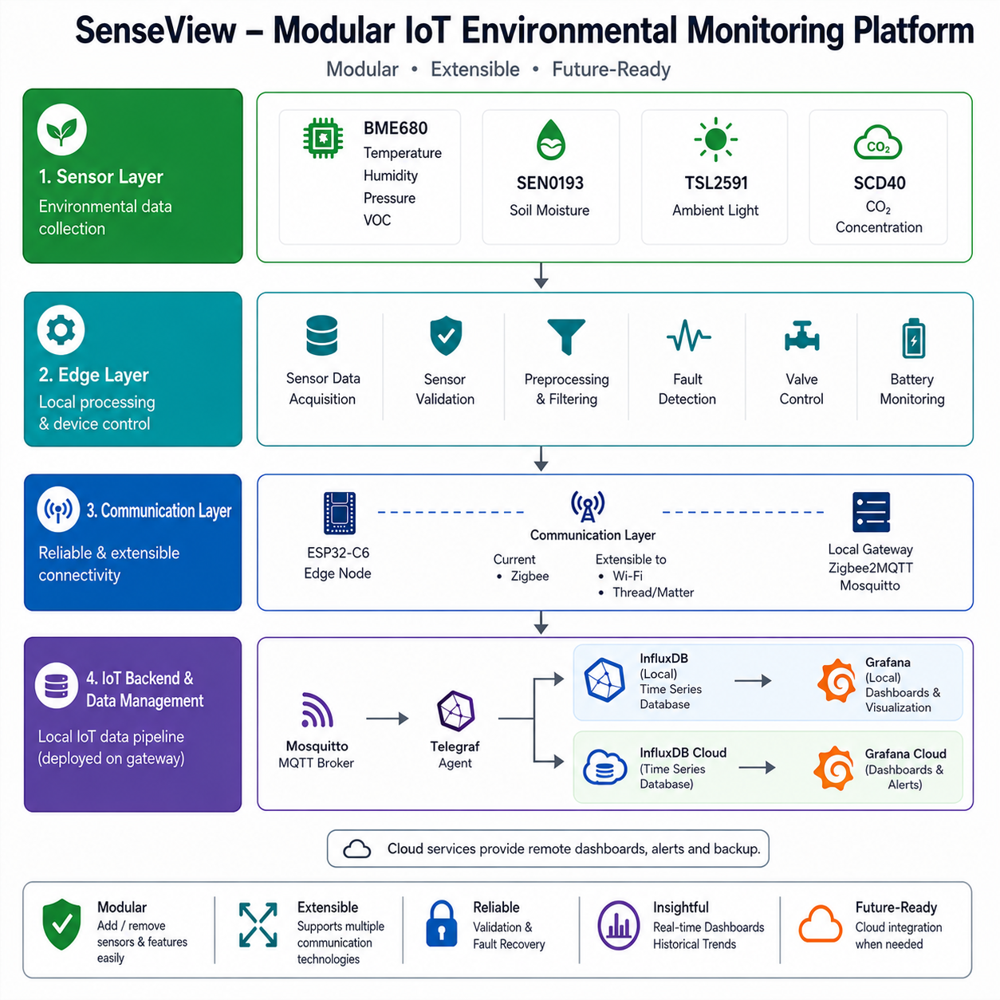
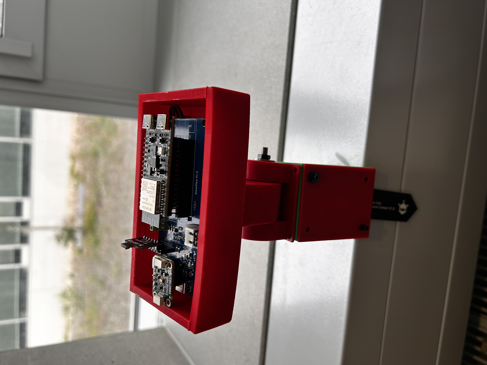
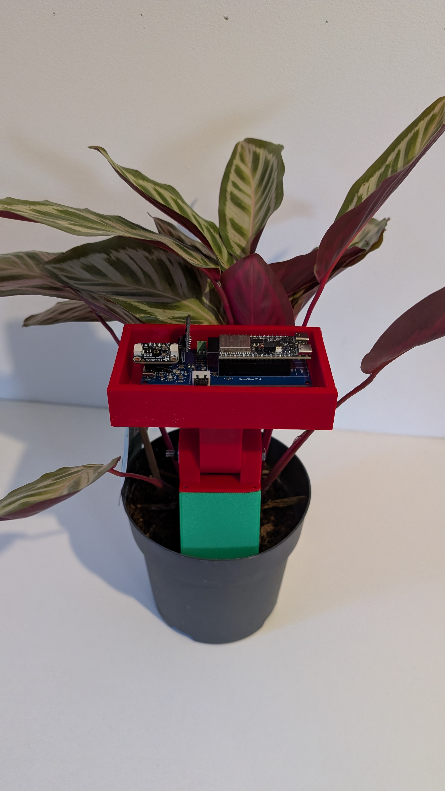

# SenseView – Modular IoT Environmental Monitoring Platform

> **An end-to-end IoT platform engineered from concept to deployment, integrating custom hardware, embedded firmware, and a scalable edge-to-cloud data pipeline.**

---

## Overview

SenseView is a battery-powered IoT environmental monitoring platform developed to demonstrate the complete lifecycle of an embedded IoT system—from hardware design and firmware development to data acquisition, visualization, and cloud integration.

Originally developed as part of a Master's thesis in Electrical and Microsystems Engineering, the project was driven by research objectives emphasizing measurement quality, reliability, modularity, and low-power operation rather than minimizing hardware cost. Consequently, hardware and sensor selection were based on engineering requirements rather than cost optimization.

The platform combines a custom-designed ESP32-C6 sensor node, modular embedded firmware, and a complete MQTT-based backend capable of simultaneously storing data in both local and cloud time-series databases. Although the current implementation uses Zigbee communication, the architecture was intentionally designed to support future migration to Wi-Fi or Thread/Matter with minimal changes.

---

# System Architecture

<p align="center">
  
</p>

---

# Engineering Highlights

- Designed and manufactured a custom ESP32-C6 PCB using KiCad.
- Developed embedded firmware for environmental sensing, sensor validation, preprocessing, fault detection, battery monitoring, and automated irrigation control.
- Built a complete MQTT-based IoT backend using Mosquitto, Telegraf, InfluxDB, and Grafana.
- Implemented simultaneous local and cloud data storage using Telegraf dual-output configuration.
- Designed the communication layer to remain extensible to Zigbee, Wi-Fi, and Thread/Matter.
- Designed a custom deployment enclosure using SolidWorks.
- Integrated environmental sensing, data visualization, and irrigation control into a single modular IoT platform.

---

# Technology Stack

| Category | Technology |
|-----------|------------|
| Microcontroller | ESP32-C6 |
| Sensors | SCD40, BME680, TSL2591, SEN0193 |
| Communication | Zigbee (Extensible to Wi-Fi & Thread/Matter) |
| Firmware | Arduino Framework (C++) |
| MQTT Broker | Mosquitto |
| Data Collection | Telegraf |
| Database | InfluxDB + InfluxDB Cloud |
| Dashboard | Grafana + Grafana Cloud |
| PCB Design | KiCad |
| Mechanical Design | SolidWorks |

---

# Gallery

## Complete Device

<p align="center">

</p>

## Custom PCB

<p align="center">

</p>

## Grafana Dashboard

<p align="center">

</p>

## Deployment

<p align="center">

</p>

---

# Hardware

## Microcontroller

- ESP32-C6 Development Board

## Sensors

| Sensor | Purpose |
|---------|----------|
| Sensirion SCD40 | CO₂ Concentration |
| Bosch BME680 | Temperature, Humidity, Pressure, VOC |
| Adafruit TSL2591 | Ambient Light |
| DFRobot SEN0193 | Soil Moisture |

## Additional Hardware

- Custom PCB
- Li-Po Battery
- Solenoid Valve
- Custom 3D Printed Enclosure

---

# Software Architecture

## Embedded Firmware

- Sensor acquisition
- Sensor validation
- Data preprocessing
- Battery monitoring
- Irrigation control
- Fault detection

## Communication

- Zigbee
- Zigbee2MQTT

## Backend

- Mosquitto MQTT Broker
- Telegraf
- Local InfluxDB
- InfluxDB Cloud
- Local Grafana
- Grafana Cloud

---

# Repository Structure

```text
firmware/
    ESP32-C6 firmware

hardware/
    bom/
    gerbers/
    kicad/

enclosure/
    SolidWorks enclosure

images/
    Project images
```

---

# Engineering Decisions

| Decision | Reason |
|----------|--------|
| ESP32-C6 | Supports Zigbee, Wi-Fi and native Thread, enabling a modular communication architecture. |
| Zigbee | Low-power communication suitable for battery-operated IoT devices and readily available laboratory infrastructure. |
| BME680 | Higher measurement capability including VOC sensing compared to BME280. |
| Custom PCB | Improved robustness, compactness and deployment reliability compared to breadboard prototypes. |
| Telegraf | Flexible preprocessing and simultaneous transmission to both local and cloud InfluxDB instances. |

---

# Engineering Challenges

Some of the most significant engineering challenges encountered during this project included:

- Designing a reliable battery-powered power supply and custom PCB.
- Developing a complete IoT backend from MQTT through cloud visualization.
- Creating Zigbee2MQTT endpoints and integrating the custom device into the local IoT infrastructure.
- Designing a modular architecture capable of supporting future communication technologies with minimal hardware changes.

---

# Future Improvements

- Wi-Fi communication backend
- Native Thread / Matter implementation
- OTA firmware updates
- Further power optimization
- Configuration interface
- Mobile application

---

# Project Background

This project was developed as part of a Master's thesis in Electrical and Microsystems Engineering at OTH Regensburg.

Rather than focusing on building a single-purpose plant monitoring device, the objective was to engineer a reusable IoT platform capable of supporting environmental sensing applications while remaining modular, scalable and suitable for future communication technologies.

---

# Acknowledgements

I would like to thank my thesis supervisor and OTH Regensburg for providing the opportunity and research environment for this project.

---

# License

This project is licensed under the MIT License.